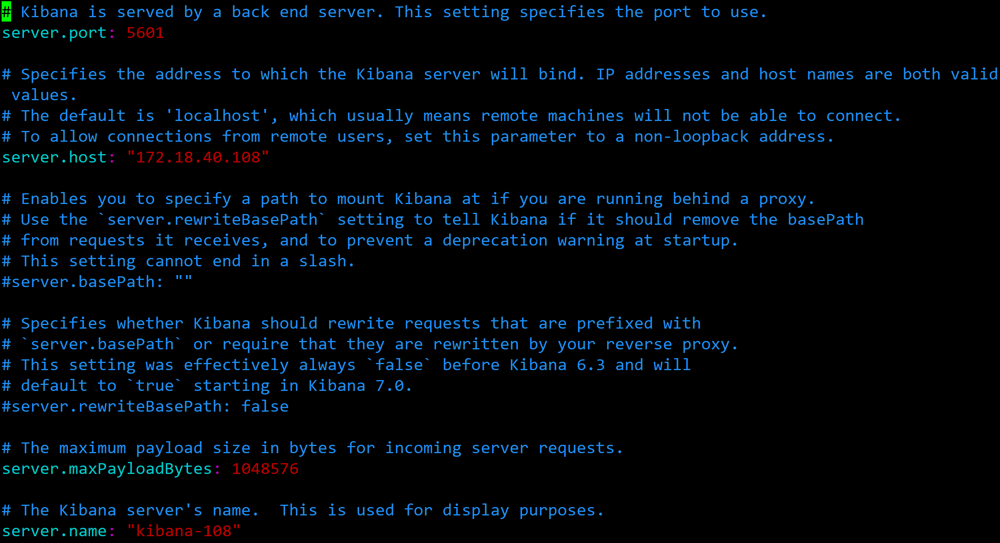

------

# ElasticSearch基础教程

## 1. **ElasticSearch**认知

### 1.1  ElasticSearch是什么？

>  		ElasticSearch(ES)是基于Lucene构建的开源、分布式、RESTful接口全文搜索引擎。 ElasticSearch还是一个分布式文档数据库，其中每个字段均是被索引的数据，且可以被搜索，能够扩展至数倍的服务器存储以及处理PB级的数据。可以在很短的时间内存储、搜索和分析大量数据。ElasticSearch基于Java开发的，并作为Apache许可条款下的开放源码发布，是当前流行的企业级搜索引擎。
>
> ​		为所有类型的数据提供实时搜索和分析。无论是<font color="#dd0000"> 结构化数据 </font>还是<font color="#dd0000">非结构化数据</font>，Elasticsearch都能以最快速的方式有效地对其进行存储和索引。不仅可以进行简单的数据检索，还可以汇总信息来发现数据中的趋势和模式。

#### **1.1.1 什么是全文搜索？**

​		全文搜索是指计算机搜索程序通过扫描文章中的每一个词，对每一个词建立一个索引，指明该词在文章中出现的次数和位置，当用户查询时，搜索程序就根据事先建立的索引进行查找，并将查找的结果反馈给用户。这个过程类似于通过字典中的搜索字表查字的过程。Lucene是目前全球使用最广的全文搜索引擎开源库。

#### **1.1.2 什么是结构化数据？**

​		结构化数据： 指具有固定格式或有限长度的数据，如数据库，元数据等。

#### **1.1.3 什么是非结构化数据？**

​		非结构化数据又可称为全文数据，指不定长或无固定格式的数据，如邮件，word文档等。

#### **1.1.4 什么是半结构化数据？**

​		如XML，HTML等，当根据需要可按结构化数据来处理，也可抽取出纯文本按非结构化数据来处理。

#### **1.1.5 什么是结构化数据搜索**？

​		根据两种数据分类，搜索也相应的分为两种：结构化数据搜索和非结构化数据搜索。

​		对于结构化数据，我们一般都是可以通过关系型数据库(mysql，oracle等)的 table 的方式存储和搜索，也可以建立索引。 对于非结构化数据，即对全文数据的搜索主要有两种方法：**顺序扫描法**，**全文检索**。


> **顺序扫描**：通过文字名称也可了解到它的大概搜索方式，即按照顺序扫描的方式查询特定的关键字。 例如给你一张报纸，让你找到该报纸中“英雄联盟”的文字在哪些地方出现过。你肯定需要从头到尾把报纸阅读扫描一遍然后标记出关键字在哪些版块出现过以及它的出现位置。
>
> 这种方式无疑是最耗时的最低效的，如果报纸排版字体小，而且版块较多甚至有多份报纸，等你扫描完你的眼睛也差不多了。


> **全文搜索**：对非结构化数据顺序扫描很慢，我们是否可以进行优化？把我们的非结构化数据想办法弄得有一定结构不就行了吗？将非结构化数据中的一部分信息提取出来，重新组织，使其变得有一定结构，然后对此有一定结构的数据进行搜索，从而达到搜索相对较快的目的。这种方式就构成了全文检索的基本思路。这部分从非结构化数据中提取出的然后重新组织的信息，我们称之**索引**
>
> 还以读报纸为例，我们想关注最近英雄联盟的赛事新闻，假如都是 RNG 的粉丝，如何快速找到 RNG 新闻的报纸和版块呢？全文搜索的方式就是，将所有报纸中所有版块中关键字进行提取，如"EDG"，"RNG"，"FW"，"战队"，"英雄联盟"等。然后对这些关键字建立索引，通过索引我们就可以对应到该关键词出现的报纸和版块。注意区别目录搜索引擎。
>
> Ps：目录搜索引擎]是以人工方式或半自动方式搜集信息，由编辑员查看信息之后，人工形成信息摘要，并将信息置于事先确定的分类框架中。信息大多面向网站，提供目录浏览服务和直接检索服务。


### 1.2 为什么使用ElasticSearch？

​		为什么要用搜索引擎？我们的所有数据在数据库里面都有，而且 Oracle、SQL Server 等数据库里也能提供查询检索或者聚类分析功能，直接通过数据库查询不就可以了吗？确实，我们大部分的查询功能都可以通过数据库查询获得，如果查询效率低下，还可以通过建数据库索引，优化SQL等方式进行提升效率，甚至通过引入缓存来加快数据的返回速度。如果数据量更大，就可以分库分表来分担查询压力。


那为什么还要全文搜索引擎呢？我们主要从以下几个原因分析：

- **数据类型** 全文索引搜索支持非结构化数据的搜索，可以更好地快速搜索大量存在的任何单词或单词组的非结构化文本。 例如 Google，百度类的网站搜索，它们都是根据网页中的关键字生成索引，我们在搜索的时候输入关键字，它们会将该关键字即索引匹配到的所有网页返回；还有常见的项目中应用日志的搜索等等。对于这些非结构化的数据文本，关系型数据库搜索不是能很好的支持。
- **索引的维护** 一般传统数据库，全文检索都实现的很鸡肋，因为一般也没人用数据库存文本字段。进行全文检索需要扫描整个表，如果数据量大的话即使对SQL的语法优化，也收效甚微。建立了索引，但是维护起来也很麻烦，对于 insert 和 update 操作都会重新构建索引。

-  **搜索性能** 如果使⽤mysql做搜索，⽐如有个player表，这个表有user_name这个字段，我们要查找出 user_name以james开头的球员，和含有James的球员。我们⼀般怎么做？数据量达到千万级 别的时候怎么办？

  ```mysql
  select * from player where user_name like 'james%';
  ```

- **灵活搜索**  如果我们想查出名字叫james的球员，但是⽤户输⼊了jame，我们想提示他⼀些关键字

  

  如果我们想查出带有"冠军"关键字的⽂章，但是⽤户输⼊了"总冠军"，我们也希望能查出来。

  

什么时候使用全文搜索引擎：

1. 搜索的数据对象是大量的非结构化的文本数据。
2. 文件记录量达到数十万或数百万个甚至更多。
3. 支持大量基于交互式文本的查询。
4. 需求非常灵活的全文搜索查询。
5. 对高度相关的搜索结果的有特殊需求，但是没有可用的关系数据库可以满足。
6. 对不同记录类型、非文本数据操作或安全事务处理的需求相对较少的情况。


------


### 1.3  Elasticsearch主要功能

- 分布式的搜索引擎和数据分析引擎。
- 存储和分析日志、指标和安全事件等数据
- 大数据近实时分析引擎     

例如：

1. 可以使用ElasticSearch存储商品的目录和库存信息，为客户提供精准搜索，也可以为客户推荐相关商品
2. 可以收集日志或者交易数据，对其进行分析和挖掘，寻找趋势，进行统计和总结。
3. 当有海量数据时，可以使用ElasticSearch来存储数据，通过Kibana建立自定义的仪表盘面板来显示数据。


------


### 1.4 Elasticsearch和Lucene、Solr的比较

------

​		现在主流的搜索引擎大概就是：Lucene，Solr，ElasticSearch。而Solr和ElasticSearch也是基于Lucene开发的。它们的索引建立都是根据**倒排索引**的方式生成索引，**何谓倒排索引？**


####  什么是倒排索引？

​		倒排索引是一种索引方法，被用来存储在全文搜索下某个单词在一个文档或者一组文档中的存储位置的映射，常被应用于搜索引擎和关键字查询的问题中。

​	**倒排索引(Inverted Index)**：倒排索引是实现“单词-文档矩阵”的一种具体存储形式，通过倒排索引，可以根据单词快速获取包含这个单词的文档列表。倒排索引主要由三个部分组成：“单词词典”、“倒排文件”、“倒排列表”。

​	**单词词典(Lexicon)**：搜索引擎的通常索引单位是单词，单词词典是由文档集合中出现过的所有单词构成的字符串集合，单词词典内每条索引项记载单词本身的一些信息以及指向“倒排列表”的指针。

​    **倒排列表(PostingList)：**倒排列表记载了出现过某个单词的所有文档的文档列表及单词在该文档中出现的位置信息，每条记录称为一个倒排项(Posting)。根据倒排列表，即可获知哪些文档包含某个单词。

​    **倒排文件(Inverted File)：**所有单词的倒排列表往往顺序地存储在磁盘的某个文件里，这个文件即被称之为倒排文件，倒排文件是存储倒排索引的物理文件。


例如：

​		假设文档集合包含五个文档，每个文档内容如图所示，在图中最左端一栏是每个文档对应的文档编号。我们的任务就是对这个文档集合建立倒排索引。


------

**简单的倒排索引**

​		中文和英文等语言不同，单词之间没有明确分隔符号，所以首先要用分词系统将文档自动切分成单词序列。这样每个文档就转换为由单词序列构成的数据流，为了系统后续处理方便，需要对每个不同的单词赋予唯一的单词编号，同时记录下哪些文档包含这个单词，在如此处理结束后，我们可以得到最简单的倒排索引（参考图3-4）。在图4中，“单词ID”一栏记录了每个单词的单词编号，第二栏是对应的单词，第三栏即每个单词对应的倒排列表。比如单词“谷歌”，其单词编号为1，倒排列表为{1,2,3,4,5}，说明文档集合中每个文档都包含了这个单词。


------

　　之所以说图4所示倒排索引是最简单的，是因为这个索引系统只记载了哪些文档包含某个单词，而事实上，索引系统还可以记录除此之外的更多信息。图5是一个相对复杂些的倒排索引，与图4的基本索引系统比，在单词对应的倒排列表中不仅记录了文档编号，还记载了单词频率信息（TF），即这个单词在某个文档中的出现次数，之所以要记录这个信息，是因为词频信息在搜索结果排序时，计算查询和文档相似度是很重要的一个计算因子，所以将其记录在倒排列表中，以方便后续排序时进行分值计算。在图5的例子里，单词“创始人”的单词编号为7，对应的倒排列表内容为：（3:1），其中的3代表文档编号为3的文档包含这个单词，数字1代表词频信息，即这个单词在3号文档中只出现过1次，其它单词对应的倒排列表所代表含义与此相同。


------

　	实用的倒排索引还可以记载更多的信息，图6所示索引系统除了记录文档编号和单词频率信息外，额外记载了两类信息，即每个单词对应的“文档频率信息”（对应图6的第三栏）以及在倒排列表中记录单词在某个文档出现的位置信息。


  		“文档频率信息”代表了在文档集合中有多少个文档包含某个单词，之所以要记录这个信息，其原因与单词频率信息一样，这个信息在搜索结果排序计算中是非常重要的一个因子。而单词在某个文档中出现的位置信息并非索引系统一定要记录的，在实际的索引系统里可以包含，也可以选择不包含这个信息，之所以如此，因为这个信息对于搜索系统来说并非必需的，位置信息只有在支持“短语查询”的时候才能够派上用场。

  		 以单词“拉斯”为例，其单词编号为8，文档频率为2，代表整个文档集合中有两个文档包含这个单词，对应的倒排列表为：{(3;1;<4>)，(5;1;<4>)},其含义为在文档3和文档5出现过这个单词，单词频率都为1，单词“拉斯”在两个文档中的出现位置都是4，即文档中第四个单词是“拉斯”。

  		 图6所示倒排索引已经是一个非常完备的索引系统，实际搜索系统的索引结构基本如此，区别无非是采取哪些具体的数据结构来实现上述逻辑结构。

   		有了这个索引系统，搜索引擎可以很方便地响应用户的查询，比如用户输入查询词“Facebook”，搜索系统查找倒排索引，从中可以读出包含这个单词的文档，这些文档就是提供给用户的搜索结果，而利用单词频率信息、文档频率信息即可以对这些候选搜索结果进行排序，计算文档和查询的相似性，按照相似性得分由高到低排序输出，此即为搜索系统的部分内部流程，


------


​		Lucene是一个Java全文搜索引擎，完全用Java编写。Lucene不是一个完整的应用程序，而是一个代码库和API，可以很容易地用于向应用程序添加搜索功能。但是Lucene只是一个框架，要充分利用它的功能，需要使用JAVA，并且在程序中集成Lucene。需要很多的学习了解，才能明白它是如何运行的，熟练运用Lucene确实非常复杂。


####  数据源

​		Solr接受来自不同来源的数据，包括XML文件，逗号分隔符（CSV）文件和从数据库中的表提取的数据以及常见的文件格式（如Microsoft Word和PDF）。

​	    Elasticsearch 仅支持json文件格式但还支持其他来源的数据，例如ActiveMQ，AWS SQS，DynamoDB（Amazon NoSQL），FileSystem，Git，JDBC，JMS，Kafka，LDAP，MongoDB，neo4j，RabbitMQ，Redis，Solr和Twitter。还有各种插件可用。


#### 搜索

​		Solr专注于文本搜索，而Elasticsearch则常用于查询、过滤和分组分析统计，Elasticsearch背后的团队也努力让这些查询更为高效。因此当比较两者时，对那些不仅需要文本搜索，同时还需要复杂的时间序列搜索和聚合的应用程序而言，毫无疑问Elasticsearch是最佳选择。


#### 索引

​		两者都支持使用停用词和同义词来匹配文档。

​		在Solr中，索引间进行join必须是单个分片和其他节点上的副本集进行关联来搜索文档间关系（例如SQL连接）。而Elasticsearch提供更高效的has_children和top_children查询来检索这样的相关文档。

​	 	

#### 可扩展性和分布式

​		Elasticsearch非常易于扩展，拥有足够多的需要大集群的使用案例。

​		Solr 基于Apache ZooKeeper也实现了类似ES的分布式部署模式。ZooKeeper是成熟和广泛使用的独立应用程序。

​		相对比，Elasticsearch有一个内置的类似ZooKeeper的名为Zen的组件，通过内部的协调机制来维护集群状态。可以说Elasticsearch是转为云而设计，是分布式首选。


#### 分片拆分和再平衡

​		shards是luence索引的分区单元，solr和elasticsearch均使用。你可以通过在集群中的不同计算机上运行shard来分发索引。随着SolrCloud的引入，Solr开始支持shard拆分，这允许 通过拆分现有shard来添加更多shard。

​		ElasticSearch仍然不支持这一点。ES通过向设置中添加更多计算机，可以使用自动碎片平衡功能。相比之下，Solr允许添加分片（使用隐式路由时）或分割（使用复合ID时），但不能删除分片。允许增加副本。在Elasticsearch中，默认情况下每个索引具有五个分片。不允许更改主分片的数量，但允许增加副本的数量。分片再平衡对于水平扩容非常有用。当添加新机器时，它将自动重新平衡不同机器中可用的分片。


#### 社区

​		Solr有一个广泛的开源社区。任何人都可以贡献给Solr，新的Solr开发人员或代码提交者只能根据功能选择。 Elasticsearch在技术上是开源的，但并不是完全开源。所有贡献者都可以访问源代码，用户可以进行并提交代码。但最终是否采用由Elastic（运行Elasticsearch和其他软件的公司）的员工确认和完成。

​		Solr贡献者和提交者跨越多个组织，而Elasticsearch提交者仅来自Elastic。Solr的强大社区由大多数人一起贡献并且许多知名公司参与。

​		两者都有很好的用户群和丰富的开发人员社区，但ElasticSearch相较于Solr， Solr已经存在了更长的时间，所以它的生态系统是更丰富，拥有更大的用户群。


#### 文档

​		Solr在这里得分很高。它是一个非常有据可查的产品，具有清晰的示例和API用例场景。 

​		Elasticsearch的文档组织良好，但它缺乏好的示例和清晰的配置说明。


#### 应用场景和功能

​		**Solr：**

​					全⽂搜索 

​					分⾯搜索 

​     				实时索引 

​					动态群集

​					 数据库集成 NoSQL功能和丰富的⽂档处理

​			

​		**Elasticsearch：**

​					分布式搜索

​					数据分析

​					分组和聚合

​					⽇志数据分析

​					BI系统

​					站内搜索


#### 对比图


### 1.5 Elasticsearch 版本升级和主要特性

- 0.4：2010年2月第一次发布
- 1.0:   2014年1月
- 2.0   2015年10月
- 5.0   2016年10月
- 6.0   2017年10月
- 7.0   2019年4月


#### **新特性5.x**


------


#### **新特性6.x**


------


#### **新特性7.x**


------


## 2. 安装Elasticearch

### 2.1 Elasticearch文件目录


### 2.2 JVM配置


​		在JAVA_OPTS中对Elasticsearch最重要的参数是-Xmx最大可以使用内存的参数，一半情况下大内存更能发挥Elasticsearch的作用，建议-Xmx设置为物理内存的一半，为了减少内存分配带来的性能损耗，最好一开始就设置初始内存和最大内存都为物理内存的一半，即Xms和Xmx这两个参数。

​		默认的配置文件在elasticsearch/bin/elasticsearch.in.sh中。


------


### 2.3 单机版安装

#### **2.3.1 安装前须知** 

​	**1. 关于JDK请参考**   [官方文档](https://www.elastic.co/cn/support/matrix#matrix_jvm)

​		JDK版本必须要求是1.8以上，无论是es什么版本。Elasticsearch7.X以后自带OpenJDK。解压包里已经有最合适的jdk包了，我们只需要修改指向，让它启动时用这个包就行了。也可以在启动脚本里面配置我们自己的jdk。


2. **关于JDK版本**

   官网说明，java9、java10和java12为Oracle短期发行版本，ElasticSearch不建议使用该版本。

   

3.   **也可以指定自己物理机上的JDK**

   

   启动成功如图所示：
   
   
   
   ------
   
   
   
4. **ElasticSearch 7.x 和 ElasticSearch 6.x 版本变化很大。ES7的配置和ES6的配置也不相同**

   ​	**官方文档说明**    [参考地址](https://www.elastic.co/cn/blog/a-new-era-for-cluster-coordination-in-elasticsearch)

   

   ​		

   ------

   ​	

------

​					


------


1. 下载ElasticSearch，根据需要下载不同的版本。本例安装7.10版本

   > 下载地址 https://www.elastic.co/cn/downloads/past-releases#elasticsearch

   

2. 上传至服务器

3. 解压安装包

   >   tar -zxvf  elasticsearch-7.1.0-linux-x86_64.tar.gz

4. 修改配置文件

   > 1.进入到elasticsearch-7.1.0 config文件下
   >
   > cd elasticsearch-7.1.0/config
   >
   > 2.修改配置文件
   >
   > vim elasticsearch.yml

5. 启动ElasticSearch

   **es5之后的都不能使用添加启动参数或者修改配置文件等方法启动了，为了安全不允许使用root用户启动，必须创建用户。**

   1. 创建用户： es

      > adduser es

   2. 创建用户密码，需要输入两次

      > passwd  es

   3. 将对应的文件夹权限赋给该用户

      >  chown -R es  /app/soft/elasticsearch-7.1.0

   4. 切换至elasticsearch用户

      > su es 

   5. 进入启动目录启动  /app/soft/elasticsearch-7.1.0/bin  使用后台启动方式：./elasticsearch -d

      >  ./elasticsearch -d
      
      ​		<font color="#dd0000">启动的时候有 可能会提示要装jdk11，因为es7以上官⽅都是建议使⽤jdk11，但是⼀般只是提示信息，不影 响启动。</font>

6. 查看是否安装成功

   > 输入命令  jps

   

   浏览器输入地址：http://172.18.40.108:9200/

   

   如图所示表示ElasticSearch启动成功


------


#### 2.3.2 Elasticearch配置文件说明

| 配置属性                         | 属性说明                                                     |
| -------------------------------- | ------------------------------------------------------------ |
| cluster.name                     | 配置的集群名称，默认是elasticsearch，es服务会通过广播方式自动连接在同一网段下的es服务，通过多播方式进行通信，同一网段下可以有多个集群，通过集群名称这个属性来区分不同的集群。 |
| node.name                        | 当前配置所在机器的节点名，你不设置就默认随机指定一个name列表中名字，该name列表在es的jar包中config文件夹里name.txt文件中，其中有很多作者添加的有趣名字。 |
| node.attr.rack                   | 节点描述                                                     |
| path.data                        | 设置索引数据的存储路径，默认是es根目录下的data文件夹，可以设置多个存储路径，用逗号隔开 |
| path.logs                        | 设置日志文件的存储路径，默认是es根目录下的logs文件夹         |
| bootstrap.memory_lock            | 设置为true来锁住内存不进行swapping。因为当jvm开始swapping时es的效率 会降低，所以要保证它不swap，可以把ES_MIN_MEM和ES_MAX_MEM两个环境变量设置成同一个值，并且保证机器有足够的内存分配给es。 同时也要允许elasticsearch的进程可以锁住内# # 存，linux下启动es之前可以通过`ulimit -l unlimited`命令设置。 |
| network.host                     | 设置绑定的ip地址，可以是ipv4或ipv6的，默认为0.0.0.0，绑定这台机器的任何一个ip。 |
| http.port                        | 设置对外服务的http端口，默认为9200                           |
| discovery.seed_hosts             | 配置集群节点                                                 |
| cluster.initial_master_nodes     | 如果不设置集群会默认把第一个启动的当master，其他节点也会去局域网里搜索和选主，但是这样比较危险（可能脑裂或者卡在仲裁投票的状态时间太长之类的），所以建议你把有选主资格的节点放里面，这样就不会浪费那么多时间、资源了 |
| gateway.recover_after_nodes      | 设置集群中N个节点启动时进行数据恢复，默认为3                 |
| action.destructive_requires_name | 当删除一个索引的时候，需要指定具体索引名称                   |


------


### 2.4 安装和查看插件

安装插件命令：

> cd  bin
>
>  ./elasticsearch-plugin install 插件名称

查看插件命令：

> /bin/elasticsearch-plugin list


------


### 2.5 安装和启动错误

1. **问题一 ：es安装好之后，使用root启动报错：can not run elasticsearch as root**


错误原因：es5之后的都不能使用添加启动参数或者修改配置文件等方法启动了，为了安全不允许使用root用户启动，必须要创建用户。

**解决方案：**

1. 创建用户： es

   > adduser es

2. 创建用户密码，需要输入两次

   > passwd  es

3. 将对应的文件夹权限赋给该用户

   >  chown -R es  /app/soft/elasticsearch-7.1.0

4. 切换至elasticsearch用户

   > su es 

5. 进入启动目录启动  /app/soft/elasticsearch-7.1.0/bin  使用后台启动方式：./elasticsearch -d

   >  ./elasticsearch -d


**2.问题二：启动报错  max file descriptors [4096] for elasticsearch process is too low, increase to at least [65535]**


错误原因：elasticsearch用户拥有的可创建文件描述的权限太低，至少需要65536和262144

**解决方案：**

1. 切换到root用户修改limits.conf配置文件

   > 1.  su root
   >
   > 2.  vim /etc/security/limits.conf

2. > 在配置文件中最下面追加如下配置
   > es   hard nofile 65536
   >
   > es   soft nofile 65536
   >
   > es 是启动elasticsearch的用户

   ​	soft nofile表示软限制，hard nofile表示硬限制，

   ​	上面两行语句表示，es用户的软限制为65536，硬限制为65536，

   ​	即表示es用户能打开的最大文件数量为65537，不管它开启多少个shell。

   ​	硬限制是严格的设定，必定不能超过这个设定的数值。

   ​	软限制是警告的设定，可以超过这个设定的值，但是若超过，则有警告信息。

------


**问题三：启动报错memory locking requested for elasticsearch process but memory is not locked** 

<font color="#dd0000">不同的操作系统环境、Elasticsearch版本、Elasticsearch安装源不一样，解决方案也不同。具体可参考</font>[官方文档](https://www.elastic.co/guide/en/elasticsearch/reference/7.1/setting-system-settings.html#systemd)

本例使用的是：

操作系统：Centos7

Elasticsearch版本：7.1 

安装源: tar.gz


**解决方案：**

1.  修改/developer/elasticsearch-7.1.0/config/jvm.options文件调整JVM内存大小

   > 1. vim  /developer/elasticsearch-7.1.0/config/jvm.options
   >
   > 2.   -Xms4g  -Xmx4g    #替换为总内存的一半（Elasticsearch官方建议是主机总内存的一半）

2. 修改vim /etc/security/limits.conf 添加如下内容

   > ** hard nofile 65536
   >
   > ** soft nofile 65536
   >
   > ** hard nproc 65536
   >
   > ** soft nproc 65536
   >
   > ** hard memlock unlimited
   >
   > ** soft memlock unlimited

    **  为你添加elasticsearch的用户名称

3. 让其立刻生效并执行

   > ulimit -n 65536 && ulimit -u 65536 && ulimit -l unlimited

4. 修改vim /usr/lib/systemd/system/elasticsearch.service 添加配置项

   > [Service]
   > LimitMEMLOCK=infinity

5. 运行以下命令使其生效

   > sudo systemctl daemon-reload


**问题四：启动报错: max virtual memory areas vm.max_map_count [65530] is too low, increase to at least [262144]**

错误原因： Elasticsearch [`mmapfs`](https://www.elastic.co/guide/en/elasticsearch/reference/7.1/index-modules-store.html#mmapfs)默认使用目录来存储其索引。默认的操作系统对mmap计数的限制可能太低，这可能会导致内存不足异常。

**解决方案：**

1. 切换到root用户修改 sysctl.conf配置文件

   > 1.  su root
   >
   > 2.  vim /etc/sysctl.conf  

2. 添加如下配置

   > vm.max_map_count=655360

3. 执行该命令

   > sudo sysctl -p
   >
   > 

**问题五：启动报错报错log权限不够**

启动es是非root用户启动，报错权限不够

**解决方案：**

chown -R  es /developer/elasticsearch-7.1.0 

------

## 3. ElasticSearch 基础概念

### 3.1 节点(node)

​		一个节点是一个逻辑上独立的服务，它是集群的一部分，可以存储数据，并参与集群的索引和搜索功能。跟集群一样，节点也有自己的唯一名称，通过配置文件进行配置。或者在启动的时候`./elasticsearch -e node.name=节点名称`指定。每个节点启动之后，会分配一个 UID，保存在 data 目录下。不同的节点承担着不同的角色。在网络中ElasticSearch集群通过节点进行管理和通讯。节点在本质上就是一个Java进程，一台物理机可以启动多个节点。


1. **主节点(Master-eligible nodes)**

   - ​		每个节点启动之后，默认就是 Master eligible主 节点，可以通过`node.master:false `禁止。主节点的主要职责是操作集群操作相关的内容，如创建或删除索引，跟踪哪些节点是群集的一部分，并决定哪些分片分配给相关的节点。稳定的主节点对集群的健康是非常重要的。


   - ​		默认情况下任何一个集群中的节点都有可能被选为主节点。索引数据和搜索查询等操作会占用大量的cpu，内存，io资源，为了确保一个集群的稳定，分离主节点和数据节点是一个比较好的选择。

   - ​      处理创建、删除索引等请求/决定分片被分配到那个节点/负责索引的创建与删除

   ​		**每个节点都保存了集群的状态，只有 Master 节点才能修改集群的状态信息。**

   > 集群状态 (Cluster State) ，维护了一个集群中必要的信息
   >
   > 1. 所有节点信息
   > 2. 所有的索引和其相关的 Mapping 与 Setting 信息
   > 3. 分片的路由信息
   > 4. 如果任意节点都能修改信息导致数据不一致

2. **数据节点(Data Node)**

   - ​       数据节点主要是存储索引数据的节点，主要对文档进行增删改查操作，聚合操作等。数据节点对cpu，内存，io要求较高，在优化的时候需要监控数据节点的状态，当资源不够的时候，需要在集群中添加新的节点。

   - ​       保存分片数据，在数据扩展上起到了至关重要的作用(由Master Node决定如何把分片发到数据节点上)
   - 节点启动后，默认就是数据节点。可以设置node.data.false 禁止

   ​		

3. **协调节点(Coordinating Node)**

   ​		协调节点可以跨越多个集群，可以接受每个集群的状态，然后合并成一个全局集群的状态，它可以读写所有节点上的数据。

   > ​	负责接收 Client 的请求，将请求分发到合适的节点，最终把结果汇聚到一起
   >
   > ​	每个节点默认都起到 **Coorinating Node** 的职责 

4. **冷热节点(Hot & Warm Node)**

   ​		不同的硬件配置的 Data Node, 用来实现 Hot（热数据） & Warn（旧数据）架构，以降低集群部署的成本

5. **机器学习节点**

   ​		负责跑机器学习的 JOB，用来做异常检测

6. 配置节点类型

   - 开发环境中一个节点可以承担多种角色
   - 生产环境中，应该设置单一的角色节点（dedicated note）

   

###  3.2 文档(document)

​		文档是存储在Elasticsearch中的一个JSON格式的字符串。他就像在关系数据库中表的一行。每个存储在索引中的一个文档都有一个类型和一个ID，每个文档都是一个JSON对象，存储了0个或者多个字段，也或者是键值对。


------


#### JSON 文档


- 一篇文档包含一系列的字段，类似数据库 - 表里的一条记录 (ROW)

- 文档格式灵活，不需要预先规定格式类似MYSQL里面的CHAR\VARCHAR类型 , 可以自己指定，也可以 ES 自动推算，支持数组

  ​										           **通过Logstash进行转换**


#### 文档的元数据


### 3.3 索引(index)

​		简单来说⼀个索引可以理解成⼀个关系型数据库。


### 3.4  类型(type)

​		简单来说Type相当于关系型数据库中的表，例如 user表，order表。


**抽象对比**


​		<font color="#dd0000">**5.x版本可以创建多种不同映射的类型，6.x版本依旧可以使用5.x版本创建的多种不同映射类型，7.x将完全废弃API，并在8.x版本中删除**</font>


​		

### 3.5 映射(mapping)

​			mapping定义了每个字段的类型等信息。相当于关系型数据库中的表结构。每一个索引都有一个映射，它定义了索引中的每一个字段类型，以及一个索引范围内的设置。一个映射可以事先被定义，或者在第一次存储文档的时候自动识别。


### 3.6 字段(field)

​			相当于关系型数据库表的字段，文档中包含0个或者多个字段，字段可以是一个简单的值（例如字符串、整数、日期）也可以是一个数组或者对象的嵌套结构。字段类似于关系数据库中表的列，每个字段都对应一个字段类型，例如整数、字符串、对象等。字段还可以指定如何分析该字段的值。

###  3.7 来源字段(source field)

​			默认情况下，源文档将被存储在_source这个字段中，当你查询的时候也是返回这个字段。这允许你可以从搜索结果中访问原始的对象，这个对象返回一个精确的JSON字符串，这个对象不显示索引分析后的其他任何数据。

### 3.8 主键(ID)

​			ID是一个文件的唯一标识，如果在存库的时候没有提供ID，系统会自动生成一个ID，文档的index/type/id必须是唯一的。

### 3.9 集群(cluster)

​			集群由一个或者多个节点组成，对外提供服务，对外提供索引和搜索功能。在所有节点，一个集群由一个唯一的名称默认为”Elasticsearch“。这个名称非常重要，因为每个节点只能是集群的一部分，当该节点被设置为相同的集群名称时，就会自动加入集群。当需要有更多的集群的时候，要确保每个集群的名称不能重复，否则节点可能会加入错误的集群。<font color="#dd0000">请注意，一个节点只能加入一个集群</font>


### 3.10 分片(shard)

​		 ES中所有数据均衡的存储在集群中各个节点的分片中，会影响ES的性能、安全和稳定。

 		分片是个单个Lucene实例，这是Elasticsearch管理的比较底层的功能。索引是指向主分片和副本分片的逻辑空间，们对于使用，只需要指定分片的数量，其他不需要做过多的事情。在开发使用的过程中，我们对应的对象都是索引，Elasticsearch会自动管理集群中的所有分片，当发生故障的时候，Elasticsearch会把分片移动到不同的节点或者添加到新的节点。每个分片本身是一个全功能的、独立的单元，可以托管在集群中的任何节点。

​		**简单说分片就是ES中所有数据的文件块，也是数据的最小单元块，每个索引有一个或多个分片，索引的数据被分配到各个分片上，相当于一桶水   用了N个杯子装。**

​		<font color="#dd0000">索引建立后，分片个数是不可以更改的</font>


#### 3.10.1 主分片(primary shard)

​		每个文档都存储在一个分片中，当你存储一个文档的时候，系统会首先存储在主分片中，然后会复制到不通过的副本分片中。默认情况下，一个索引有5个主分片。你可以实现制定分片的数量，当分片一旦建立，则分片的数量不能修改。⼀个Index数据在物理上被分布在多个主分⽚中，每个主分片只存放部分数据。


#### 3.10.2 副本分片(replica shard)

​		每一个分片有0个或者多个副本分片。副本分片主要是主分片的复制，其中有两个目的。

  1. 增加高可用性：当主分片失败的时候，可以从副本分片中选择一个作为主分片，保证数据完整性。

  2. 提高性能：当查询的时候可以到主分片或者副本分片中进行查询，默认情况下一个主分片配有一个副本分片。副本分片的数量可以在后面动态地配置增加。<font color="#dd0000">副本分片必须部署在不同的节点上，不能部署在和主分片相同的节点上。</font>

     

##### 分片总结

1. 读远大于写的场景，可以减少主分片个数，增加副本数，提升读吞吐率，前提是写的优先级不高。极端情况下单分片多副本可以最大程度提升总的读吞吐。
2. 写远大于读的场景，最大程度分配主分片个数，一个机器一个，并最大程度减少副本数（极端情况下集群规模不大且可用性优先级较低时可以不要副本）。
3. ElasticSearch推荐的最大JVM堆空间是30~32G, 所以把你的分片最大容量限制为30GB, 然后再对分片数量做合理估算. 例如, 你认为你的数据能达到200GB, 我们推荐你最多分配7到8个分片。


##### 分片过多所带来的副作用

- Shard是Elasticsearch实现集群水平扩展的最小单位

- 过多设置分片数会带来- 些潜在的问题
  - 每个分片是一个 Lucene的索引，会使用机器的资源。过多的分片会导致额外的性能开销
  - Lucene Inllocs / Fle descriptors / RAM/ CPU
  - 每次搜索的请求， 需要从每个分片上获取数据
  - 分片的Mola信息由Mastor节点维护。过多，会增加管理的负担。经验值，控制分片总数在10 W以内


##### 如何确定主分片数

- 从存储的物理角度看
  - 日之类应用：单个分片不要大于50GB
  - 搜索类应用：单个分片不要超过20GB
- 为什么要控制分片存储的大小
  - 提高Update的性能
  - Merge时减少所需的资源
  - 丢失节点后，具备更快的恢复速度/便于分片在集群内Rebalancing(再平衡)


##### 如何确定副本分片数

- 副本是主分片的拷贝
  - 提高系统可用性：相应查询请求，防止数据丢失
  - 需要占用和主分片一样的资源
- 对性能影响
  - 副本会降低数据的索引速度：有几份副本就会有几倍的CPU资源消耗在索引上
  - 会减缓对主分片的查询压力，但是会消耗同样的内存资源
  - 如果机器资源充分，提高副本数可以提高整体的查询QPS


##### 调整分片总数设定，避免分配不均衡

- ES的分片策略会尽量保证节点上的分片数大致相同
  - 扩容的新节点没有数据，导致新索引集中在新的节点
  - 热点数据过于集中，可能会产生性能问题


### 3.11 复制(replica)

​		当网络中的某个节点出现问题的时候，复制可以对故障进行转移，保证系统的高可用。因此，ElasticSearch允许创建一个或者多个拷贝，索引分片就形成了所谓的副本或者副本分片。每个索引可以拆分成多个分片，索引可以复制0个或者多个分片。一旦复制，每个索引就有了主分片和副本分片。分片的数量和副本的数量可以在创建索引时定义。当创建索引后，可以随时改变副本的数量，但是不能改变分片的数量。


分片数量公式：

```
总分片数=主分片数*（副分片数+1）
```

​	例如：

```shell
"settings": {
   "number_of_shards": 1,
   "number_of_replicas": 4
}
```

​	上面创建索引配置表示，总分片数=1*（1+4），表示总共5个分片。

​	

### 3.12 排序


- Elasticsearch 默认采用相关性算分对结果进行降序排序

- 可以通过设定 sorting参数，自行设定排序

- 如果不指定 score, 算分为Null 

  

**Doc Value和FieId Data进行比较**

 


**关闭Doc Values**


## 4. ElasticSearch 基础命令

1. **查看集群健康状况**

   > GET _cat/indices?v

2.  **创建索引**

   > PUT /xxx

3. **删除索引**

   > DELETE /xxx

4. **添加数据**

   > PUT /ecommerce/product/1
   > {
   >     "name" : "gaolujie yagao",
   >     "desc" :  "gaoxiao meibai",
   >     "price" :  30,
   >     "producer" :      "gaolujie producer",
   >     "tags": [ "meibai", "fangzhu" ]
   > }

5. **替换数据**

   > PUT /ecommerce/product/1
   > {
   >     "name" : "jiaqiangban gaolujie yagao"
   > }
   >
   > 替换方式有一个不好，即使必须带上所有的field，才能去进行信息的修改。不带上其余field则默认替换为空白，只有一条数据。   "name" : "jiaqiangban gaolujie yagao"

6. **修改数据**

   > POST /ecommerce/product/1/_update
   > {
   >   "doc": {
   >     "name": "jiaqiangban gaolujie yagao"
   >   }
   > }
   >
   > 这样仅仅只是修改某一个字段的数据，而不是修改全部的数据

7. **删除数据**

   > DELETE /ecommerce/product/1

## 5.ElasticSearch 搜索方式

### 5.1  query string search

1. 搜索全部商品

   > 后面添加 _search
   >
   > GET /ecommerce/product/_search

   ```
   {
     "took" : 69,
     "timed_out" : false,
     "_shards" : {
       "total" : 1,
       "successful" : 1,
       "skipped" : 0,
       "failed" : 0
     },
     "hits" : {
       "total" : {
         "value" : 3,
         "relation" : "eq"
       },
       "max_score" : 1.0,
       "hits" : [
         {
           "_index" : "ecommerce",
           "_type" : "product",
           "_id" : "1",
           "_score" : 1.0,
           "_source" : {
             "name" : "gaolujie yagao",
             "desc" : "gaoxiao meibai",
             "price" : 30,
             "producer" : "gaolujie producer",
             "tags" : [
               "meibai",
               "fangzhu"
             ]
           }
         },
         {
           "_index" : "ecommerce",
           "_type" : "product",
           "_id" : "2",
           "_score" : 1.0,
           "_source" : {
             "name" : "jiajieshi yagao",
             "desc" : "youxiao fangzhu",
             "price" : 25,
             "producer" : "jiajieshi producer",
             "tags" : [
               "fangzhu"
             ]
           }
         },
         {
           "_index" : "ecommerce",
           "_type" : "product",
           "_id" : "3",
           "_score" : 1.0,
           "_source" : {
             "name" : "zhonghua yagao",
             "desc" : "caoben zhiwu",
             "price" : 40,
             "producer" : "zhonghua producer",
             "tags" : [
               "qingxin"
             ]
           }
         }
       ]
     }
   }
   
   took：耗费了几毫秒
   timed_out：是否超时，这里是没有
   _shards：数据拆成了5个分片，所以对于搜索请求，会打到所有的primary shard（或者是它的某个replica shard也可以）
   hits.total：查询结果的数量，3个document
   hits.max_score：score的含义，就是document对于一个search的相关度的匹配分数，越相关，就越匹配，分数也高
   hits.hits：包含了匹配搜索的document的详细数据
   ```

2. 搜索商品名称中包含yagao的商品，而且按照售价降序排序

   > 传入参数：q=name:yagao&sort=price:desc
   >
   > GET /ecommerce/product/_search?q=name:yagao&sort=price:desc


### 5.2  query DSL

**DSL：Domain Specified Language，特定领域的语言
http request body：请求体，可以用json的格式来构建查询语法，比较方便，可以构建各种复杂的语法，比query string search肯定强大多了**

1. **查询所有的商品**

   > GET /ecommerce/product/_search
   > {
   >   "query": { "match_all": {} }
   > }

2.  **查询名称包含yagao的商品，同时按照价格降序排序**

   > GET /ecommerce/product/_search
   > {
   >     "query" : {
   >         "match" : {
   >             "name" : "yagao"
   >         }
   >     },
   >     "sort": [
   >         { "price": "desc" }
   >     ]
   > }

3. **分页查询商品，总共3条商品，假设每页就显示1条商品，现在显示第2页，所以就查出来第2个商品**

   > GET /ecommerce/product/_search
   > {
   >   "query": { "match_all": {} },
   >   "from": 1,
   >   "size": 1
   > }

4. **指定要查询出来商品的名称和价格就可以**

   > GET /ecommerce/product/_search
   > {
   >   "query": { "match_all": {} },
   >   "_source": ["name", "price"]
   > }

### 5.3 query filter

 1. 搜索商品名称包含yagao，而且售价大于25元的商品

    > GET /ecommerce/product/_search
    > {
    >     "query" : {
    >         "bool" : {
    >             "must" : {
    >                 "match" : {
    >                     "name" : "yagao" 
    >                 }
    >             },
    >             "filter" : {
    >                 "range" : {
    >                     "price" : { "gt" : 25 } 
    >                 }
    >             }
    >         }
    >     }
    > }

### 5.4 full-text search（全文检索）

1.  搜索牙膏商品的数据

   > GET /ecommerce/product/_search
   > {
   >     "query" : {
   >         "match" : {
   >             "producer" : "yagao producer"
   >         }
   >     }
   > }

   ```
   #! Deprecation: [types removal] Specifying types in search requests is deprecated.
   {
     "took" : 148,
     "timed_out" : false,
     "_shards" : {
       "total" : 1,
       "successful" : 1,
       "skipped" : 0,
       "failed" : 0
     },
     "hits" : {
       "total" : {
         "value" : 3,
         "relation" : "eq"
       },
       "max_score" : 0.13353139,
       "hits" : [
         {
           "_index" : "ecommerce",
           "_type" : "product",
           "_id" : "1",
           "_score" : 0.13353139,
           "_source" : {
             "name" : "gaolujie yagao",
             "desc" : "gaoxiao meibai",
             "price" : 30,
             "producer" : "gaolujie producer",
             "tags" : [
               "meibai",
               "fangzhu"
             ]
           }
         },
         {
           "_index" : "ecommerce",
           "_type" : "product",
           "_id" : "2",
           "_score" : 0.13353139,
           "_source" : {
             "name" : "jiajieshi yagao",
             "desc" : "youxiao fangzhu",
             "price" : 25,
             "producer" : "jiajieshi producer",
             "tags" : [
               "fangzhu"
             ]
           }
         },
         {
           "_index" : "ecommerce",
           "_type" : "product",
           "_id" : "3",
           "_score" : 0.13353139,
           "_source" : {
             "name" : "zhonghua yagao",
             "desc" : "caoben zhiwu",
             "price" : 40,
             "producer" : "zhonghua producer",
             "tags" : [
               "qingxin"
             ]
           }
         }
       ]
     }
   }
   
   
   producer这个字段，会先被拆解，建立倒排索引
   
   special		4
   yagao		4
   producer	1,2,3,4
   gaolujie	1
   zhognhua	3
   jiajieshi	2
   ```

   

### 5.5 phrase search（短语搜索）

​		**跟全文检索相对应，相反，全文检索会将输入的搜索串拆解开来，去倒排索引里面去一一匹配，只要能匹配上任意一个拆解后的单词，就可以作为结果返回
phrase search，要求输入的搜索串，必须在指定的字段文本中，完全包含一模一样的，才可以算匹配，才能作为结果返回**

1. **查询牙膏商品**

   > GET /ecommerce/product/_search
   > {
   >     "query" : {
   >         "match_phrase" : {
   >             "producer" : "yagao producer"
   >         }
   >     }
   > }
   >
   > 


### 5.6 highlight search（高亮搜索结果）

1. **查询商品牙膏**

   > GET /ecommerce/product/_search
   > {
   >     "query" : {
   >         "match" : {
   >             "producer" : "producer"
   >         }
   >     },
   >     "highlight": {
   >         "fields" : {
   >             "producer" : {}
   >         }
   >     }
   > }

   ```
   #! Deprecation: [types removal] Specifying types in search requests is deprecated.
   {
     "took" : 307,
     "timed_out" : false,
     "_shards" : {
       "total" : 1,
       "successful" : 1,
       "skipped" : 0,
       "failed" : 0
     },
     "hits" : {
       "total" : {
         "value" : 3,
         "relation" : "eq"
       },
       "max_score" : 0.13353139,
       "hits" : [
         {
           "_index" : "ecommerce",
           "_type" : "product",
           "_id" : "1",
           "_score" : 0.13353139,
           "_source" : {
             "name" : "gaolujie yagao",
             "desc" : "gaoxiao meibai",
             "price" : 30,
             "producer" : "gaolujie producer",
             "tags" : [
               "meibai",
               "fangzhu"
             ]
           },
           "highlight" : {
             "producer" : [
               "gaolujie <em>producer</em>"
             ]
           }
         },
         {
           "_index" : "ecommerce",
           "_type" : "product",
           "_id" : "2",
           "_score" : 0.13353139,
           "_source" : {
             "name" : "jiajieshi yagao",
             "desc" : "youxiao fangzhu",
             "price" : 25,
             "producer" : "jiajieshi producer",
             "tags" : [
               "fangzhu"
             ]
           },
           "highlight" : {
             "producer" : [
               "jiajieshi <em>producer</em>"
             ]
           }
         },
         {
           "_index" : "ecommerce",
           "_type" : "product",
           "_id" : "3",
           "_score" : 0.13353139,
           "_source" : {
             "name" : "zhonghua yagao",
             "desc" : "caoben zhiwu",
             "price" : 40,
             "producer" : "zhonghua producer",
             "tags" : [
               "qingxin"
             ]
           },
           "highlight" : {
             "producer" : [
               "zhonghua <em>producer</em>"
             ]
           }
         }
       ]
     }
   }
   
   
   ```

   **带有<em></em>标签的表示为高亮词，例如<em>producer</em>表示价格高亮**


### 5.7 term(词条)查询

​		**词条查询：词条查询不会分析查询条件，只有当词条和查询字符串完全匹配时，才匹配搜索。**

1. 单条term查询(精确查询)

   POST  localhost:9200/nba/_search

   ```json
   {
       "query":{
           "term":{
               "jerse_no":"23"
           }
       }
   }
   ```

2. 多条term查询

   POST  localhost:9200/nba/_search

   ```json
   {
       "query":{
           "terms":{
               "jerse_no":[
                   "23",
                   "13"
               ]
           }
       }
   }
   ```

      **全⽂查询：ElasticSearch引擎会先分析查询字符串，将其拆分成多个分词，只要已分析的字 段中包含词条的任意⼀个，或全部包含，就匹配查询条件，返回该⽂档；如果不包含任意⼀ 个分词，表示没有任何⽂档匹配查询条件**

1. match_all(查询全部)

   POST localhost:9200/nba/_search

   ```json
   {
       "query":{
           "match_all":{
   			"name":"詹姆斯大叔"
           }
       },
       "from":0,
       "size":10
   }
   
   form:分页
   size:查询数量
   ```

2. match(模糊查询)json

   POST localhost:9200/nba/_search

   ```json
   {
       "query":{
           "match":{
                "name": "詹姆斯斯斯斯斯"
           }
       },
       "from":0,
       "size":10
   }
   ```

3. multi_match(多个查询)

   POST  localhost:9200/nba/_search

   ```json
   {
       "query":{
           "multi_match":{
               "query":"shooter",
               "fields":[
                   "title",
                   "name"
               ]
           }
       }
   }
   ```

4. match_phrase(精确查询)

   POST  localhost:9200/nba/_search

   ```json
   {
       "query":{
           "match_phrase":{
               "position":"得分后卫"
           }
       }
   }
   ```

5. match_phrase_prefix(前缀查询)

   POST  localhost:9200/nba/_search

   ```json
   {
       "query":{json
               "title":"the best s"
           }
       }
   }
   ```
   


## 6.  分词器

### 6.1 什么是分词器？

​	**将⽤户输⼊的⼀段⽂本，按照⼀定逻辑，分析成多个词语的⼀种⼯具**

------


### 6.2 内置的分词器

1. standard analyzer 
2. simple analyzer
3.  whitespace analyzer
4.  stop analyzer 
5. language analyzer 
6. pattern analyzer


#### 6.2.1 standard analyzer (默认的分词器)

- 标准分析器是默认分词器，如果未指定，则使⽤该分词器。

  示例：

  ​			POST localhost:9200/_analyze

  ```json
  {
   "analyzer": "standard",
   "text": "The best 3-points shooter is Curry!"
  }
  ```

  返回值：

  ```json
  {
      "tokens": [
          {
              "token": "the",
              "start_offset": 0,
              "end_offset": 3,
              "type": "<ALPHANUM>",
              "position": 0
          },
          {
              "token": "best",
              "start_offset": 4,
              "end_offset": 8,
              "type": "<ALPHANUM>",
              "position": 1
          },
          {
              "token": "3",
              "start_offset": 9,
              "end_offset": 10,
              "type": "<NUM>",
              "position": 2
          },
          {
              "token": "points",
              "start_offset": 11,
              "end_offset": 17,
              "type": "<ALPHANUM>",
              "position": 3
          },
          {
              "token": "shooter",
              "start_offset": 18,
              "end_offset": 25,
              "type": "<ALPHANUM>",
              "position": 4
          },
          {
              "token": "is",
              "start_offset": 26,
              "end_offset": 28,
              "type": "<ALPHANUM>",
              "position": 5
          },
          {
              "token": "curry",
              "start_offset": 29,
              "end_offset": 34,
              "type": "<ALPHANUM>",
              "position": 6
          }
      ]
  }
  ```


#### 6.2.2  simple analyzer(简单的分词器)

- simple 分析器当它遇到只要不是字⺟的字符，就将⽂本解析成term，⽽且所有的term都是

  示例：

  ​			POST localhost:9200/_analyze

  ```json
  {
   "analyzer": "simple",
   "text": "The best 3-points shooter is Curry!"
  }
  ```

  返回示例：

  ```json
  {
      "tokens": [
          {
              "token": "the",
              "start_offset": 0,
              "end_offset": 3,
              "type": "word",
              "position": 0
          },
          {
              "token": "best",
              "start_offset": 4,
              "end_offset": 8,
              "type": "word",
              "position": 1
          },
          {
              "token": "points",
              "start_offset": 11,
              "end_offset": 17,
              "type": "word",
              "position": 2
          },
          {
              "token": "shooter",
              "start_offset": 18,
              "end_offset": 25,
              "type": "word",
              "position": 3
          },
          {
              "token": "is",
              "start_offset": 26,
              "end_offset": 28,
              "type": "word",
              "position": 4
          },
          {
              "token": "curry",
              "start_offset": 29,
              "end_offset": 34,
              "type": "word",
              "position": 5
          }
      ]
  }
  ```

  


#### 6.2.3 whitespace analyzer(空白分词器)

- whitespace 分析器，当它遇到空⽩字符时，就将⽂本解析成terms

  示例：

  ​		POST localhost:9200/_analyze

  ```json
  {
   "analyzer": "whitespace",
   "text": "The best 3-points shooter is Curry!"
  }
  ```

  返回示例：

  ```json
  {
      "tokens": [
          {
              "token": "The",
              "start_offset": 0,
              "end_offset": 3,
              "type": "word",
              "position": 0
          },
          {
              "token": "best",
              "start_offset": 4,
              "end_offset": 8,
              "type": "word",
              "position": 1
          },
          {
              "token": "3-points",
              "start_offset": 9,
              "end_offset": 17,
              "type": "word",
              "position": 2
          },
          {
              "token": "shooter",
              "start_offset": 18,
              "end_offset": 25,
              "type": "word",
              "position": 3
          },
          {
              "token": "is",
              "start_offset": 26,
              "end_offset": 28,
              "type": "word",
              "position": 4
          },
          {
              "token": "Curry!",
              "start_offset": 29,
              "end_offset": 35,
              "type": "word",
              "position": 5
          }
      ]
  }
  ```

  

#### 6.2.4 stop analyzer( 停止的分词器)

- stop 分析器 和 simple 分析器很像，唯⼀不同的是，stop 分析器增加了对删除停⽌词的⽀ 持，默认使⽤了english停⽌词

- stopwords 预定义的停⽌词列表，⽐如 (the,a,an,this,of,at)等等

  示例：

  ​		POST localhost:9200/_analyze

  ```json
  {
   "analyzer": "stop",
   "text": "The best 3-points shooter is Curry!"
  }
  ```

  返回值：

  ```json
  {
      "tokens": [
          {
              "token": "best",
              "start_offset": 4,
              "end_offset": 8,
              "type": "word",
              "position": 1
          },
          {
              "token": "points",
              "start_offset": 11,
              "end_offset": 17,
              "type": "word",
              "position": 2
          },
          {
              "token": "shooter",
              "start_offset": 18,
              "end_offset": 25,
              "type": "word",
              "position": 3
          },
          {
              "token": "curry",
              "start_offset": 29,
              "end_offset": 34,
              "type": "word",
              "position": 5
          }
      ]
  }
  ```

  

#### 6.2.5 language analyzer(语言分词器)

- （特定的语⾔的分词器，⽐如说，english，英语分词器),内置语⾔：arabic, armenian, basque, bengali, brazilian, bulgarian, catalan, cjk, czech, danish, dutch, english, finnish, french, galician, german, greek, hindi, hungarian, indonesian, irish, italian, latvian, lithuanian, norwegian, persian, portuguese, romanian, russian, sorani, spanish, swedish, turkish, thai

  示例：

  ​		POST localhost:9200/_analyze

  ```json
  {
   "analyzer": "english",
   "text": "The best 3-points shooter is Curry!"
  }
  ```

  返回示例：

  ```json
  {
      "tokens": [
          {
              "token": "best",
              "start_offset": 4,
              "end_offset": 8,
              "type": "<ALPHANUM>",
              "position": 1
          },
          {
              "token": "3",
              "start_offset": 9,
              "end_offset": 10,
              "type": "<NUM>",
              "position": 2
          },
          {
              "token": "point",
              "start_offset": 11,
              "end_offset": 17,
              "type": "<ALPHANUM>",
              "position": 3
          },
          {
              "token": "shooter",
              "start_offset": 18,
              "end_offset": 25,
              "type": "<ALPHANUM>",
              "position": 4
          },
          {
              "token": "curri",
              "start_offset": 29,
              "end_offset": 34,
              "type": "<ALPHANUM>",
              "position": 6
          }
      ]
  }
  ```

  


#### 6.2.6 pattern analyzer(正则表达式分词器)

- ⽤正则表达式来将⽂本分割成terms，默认的正则表达式是\W+（⾮单词字符）

  示例：

  ​		POST localhost:9200/_analyze

  ```json
  {
   "analyzer": "english",
   "text": "The best 3-points shooter is Curry!"
  }
  ```

  返回示例：

  ```json
  {
      "tokens": [
          {
              "token": "the",
              "start_offset": 0,
              "end_offset": 3,
              "type": "word",
              "position": 0
          },
          {
              "token": "best",
              "start_offset": 4,
              "end_offset": 8,
              "type": "word",
              "position": 1
          },
          {
              "token": "3",
              "start_offset": 9,
              "end_offset": 10,
              "type": "word",
              "position": 2
          },
          {
              "token": "points",
              "start_offset": 11,
              "end_offset": 17,
              "type": "word",
              "position": 3
          },
          {
              "token": "shooter",
              "start_offset": 18,
              "end_offset": 25,
              "type": "word",
              "position": 4
          },
          {
              "token": "is",
              "start_offset": 26,
              "end_offset": 28,
              "type": "word",
              "position": 5
          },
          {
              "token": "curry",
              "start_offset": 29,
              "end_offset": 34,
              "type": "word",
              "position": 6
          }
      ]
  }	
  ```

  

#### 


### 6.2中文分词器

#### 6.2.1 smartCN

- smartCN ⼀个简单的中⽂或中英⽂混合⽂本的分词器

  安装：

  > 1. 进入到ElasticSearch中Bin目录
  >
  >    cd /developer/elasticsearch-7.1.0/bin
  >
  > 2. 执行安装命令
  >
  >    sh elasticsearch-plugin install analysis-smartcn
  >
  > 3. 重启ES
  >
  > 卸载命令：sh elasticsearch-plugin remove analysis-smartcn

  检查是否安装成功

  ​	POST localhost:9200/_analyze

  ```json
  {
   "analyzer": "smartcn",
   "text": "⽕箭明年总冠军"
  }
  ```

  

#### 6.2.2 IK分词器

- 更智能更友好的中⽂分词器

  安装：

  > 1. 下载安装包，es的版本要和IK分词器版本一致
  >
  >    https://github.com/medcl/elasticsearch-analysis-ik/releases
  >
  > 2. 解压安装到plugins⽬录下新创的IK目录，IK分词器zip压缩包不能跟Plugins同目录否则会报错
  >
  >    - cd /developer/elasticsearch-7.1.0/plugins/ik
  >    - unzip  elasticsearch-analysis-ik-7.1.0.zip
  >
  > 3. 重启ES
  >
  > 4. 检查是否安装成功
  >
  >    POST localhost:9200/_analyze
  >    
  >    ```json
  > {
  >     "analyzer": "ik_max_word",
  >     "text": "⽕箭明年总冠军"
  >    }
  >    ```
  >    
  >    

------


## 7.  常⻅的字段类型

   **简介：常⻅的字段类型的介绍和使⽤**  

### 	7.1 数据类型

#### 7.1.1 核心数据类型

##### 7.1.1.1 字符串

- text

  > 用于全文索引，该类型的字段将通过分词器进行分词

- keyword

  > 不分词，只能搜索该字段的完整值

##### 7.1.1.2 数值型

- long, integer, short, byte, double, float, half_float, scaled_float

##### 7.1.1.3 布尔型

- boolean

##### 7.1.1.4 二进制

- binary

  > 该类型的字段把值当做经过 base64 编码的字符串，默认不存储，且不可搜索

##### 7.1.1.5 范围类型

- 范围类型表示值是⼀个范围，⽽不是⼀个具体的值
- integer_range, float_range, long_range, double_range, date_range
- 譬如 age 的类型是 integer_range，那么值可以是 {"gte" : 20, "lte" : 40}；搜索 "term" : {"age": 21} 可以搜索该值

##### 7.1.1.6 ⽇期 - date

- 由于Json没有date类型，所以es通过识别字符串是否符合format定义的格式来判断是否 为date类型

- format默认为：strict_date_optional_time||epoch_millis

- 格式 

  > "2022-01-01" "2022/01/01 12:10:30" 这种字符串格式

- 从开始纪元（1970年1⽉1⽇0点） 开始的毫秒数

1. 示例

   1. PUT localhost:9200/nba/_mapping

      ```json
      {
       "properties": {
       "name": {
       "type": "text"
       },
       "team_name": {
       "type": "text"
       },
       "position": {
       "type": "text"
       },
       "play_year": {
       "type": "long"
       },
      POST localhost:9200/nba/_doc/4
      POST localhost:9200/nba/_doc/5
      POST localhost:9200/nba/_doc/6
       "jerse_no": {
       "type": "keyword"
       },
       "title": {
       "type": "text"
       },
       "date": {
       "type": "date"
       }
       }
      }
      ```

      

   

   2. POST localhost:9200/nba/_doc/4

      ```json
       {
       "name": "蔡x坤",
       "team_name": "勇⼠",
       "position": "得分后卫",
       "play_year": 10,
       "jerse_no": "31",
       "title": "打球最帅的明星",
       "date":"2020-01-01"
       }
      ```

   3. POST localhost:9200/nba/_doc/5

      ```json
       {
       "name": "杨超越",
       "team_name": "猴急",
       "position": "得分后卫",
       "play_year": 10,
       "jerse_no": "32",
       "title": "打球最可爱的明星",
       "date":1610350870
       }
      ```

   4. POST localhost:9200/nba/_doc/6

      ```json
       {
       "name": "吴亦凡",
       "team_name": "湖⼈",
       "position": "得分后卫",
       "play_year": 10,
       "jerse_no": "33",
       "title": "最会说唱的明星",
       "date":1641886870000
       }
      ```

#### 7.1.2 复杂数据类型

##### 7.1.2.1 数组类型 Array

- ES中没有专⻔的数组类型, 直接使⽤[]定义即可，数组中所有的值必须是同⼀种数据类 型, 不⽀持混合数据类型的数组:
- 字符串数组 [ "one", "two" ] 
- 整数数组 [ 1, 2 ] Object对象数组 [ { "name": "Louis", "age": 18 }, { "name": "Daniel", "age": 17 }] 
- 同⼀个数组只能存同类型的数据，不能混存，譬如 [ 10, "some string" ] 是错误的

##### 7.1.2.2 对象类型 Object

- 对象类型可能有内部对象

  示例代码：

  POST localhost:9200/nba/_doc/8

  ```json
  {
   "name": "吴亦凡",
   "team_name": "湖⼈",
   "position": "得分后卫",
   "play_year": 10,
   "jerse_no": "33",
   "title": "最会说唱的明星",
   "date": "1641886870",
   "array": [
   "one",
   "two"
   ],
   "address": {
   "region": "China",
   "location": {
   "province": "GuangDong",
   "city": "GuangZhou"
   }
   }
  }
  ```

   索引方式

  ```json
   "address.region": "China",
   "address.location.province": "GuangDong",
   "address.location.city": "GuangZhou"
  ```

  POST localhost:9200/nba/_search

  ```json
  {
   "query":{
   "match":{
   "address.region":"china"
   }
   }
  }
  ```

#### 7.1.3 专用数据类型

##### 7.1.3.1 IP类型

- IP类型的字段⽤于存储IPv4或IPv6的地址, 本质上是⼀个⻓整型字段.

  示例代码：

  POST localhost:9200/nba/_mapping

  ```json
  {
   "properties": {
   "name": {
   "type": "text"
   },
   "team_name": {
   "type": "text"
   },
   "position": {
   "type": "text"
   },
   "play_year": {
   "type": "long"
   },
   "jerse_no": {
   "type": "keyword"
   },
   "title": {
   "type": "text"
   },
   "date": {
   "type": "date"
   },
   "ip_addr": {
   "type": "ip"
   }
   }
  }
  ```

  PUT localhost:9200/nba/_doc/9

  ```json
  {
   "name": "吴亦凡",
   "team_name": "湖⼈",
   "position": "得分后卫",
   "play_year": 10,
   "jerse_no": "33",
   "title": "最会说唱的明星",
   "ip_addr": "192.168.1.1"
  }
  ```

  POST localhost:9200/nba/_search

  ```json
  {
   "query": {
   "term": {
   "ip_addr": "192.168.0.0/16" //
  192.168.0.0~192.168.255.255)
   }
   }
  }
  ```

  - [官方文档](https://www.elastic.co/guide/en/elasticsearch/reference/current/mapping-types.html#_complex_datatypes)

  

## 8.  ES批量导⼊数据

**ES提供了⼀个叫 bulk 的API 来进⾏批量操作**

示例代码：

> 1. 示例文本
>
> ```
> {"index": {"_index": "book", "_type": "_doc", "_id": 1}}
> {"name": "权⼒的游戏"}
> {"index": {"_index": "book", "_type": "_doc", "_id": 2}}
> {"name": "疯狂的⽯头"}
> ```
>
> 2. 将内容保存为文本格式(txt)
>
> 3. 将保存好的文本上传到ES的目录下
>
> 4. 执行命令
>
>    curl -X POST "localhost:9200/_bulk" -H 'Content-Type: application/json' --data-binary @name
>
>    因为文本上传到了es的根目录下是想对路径，所以使用@符号  name表示为文本的名称


## 9.  ElasticSearch中分片的生命周期

### **9.1 倒排索引不可变性**

- 倒排索引采用Immutable Design(不可变)，一旦生成，不可更改
- 不可变性，优点如下：
  - 无需考 虑并发写文件的问题，避免了锁机制带来的性能问题
  - 一旦读入内核的文件系统缓存，便留在哪里。只要文件系统存有足够的空间，大部分请求就会直接请求内存，不会命中磁盘,提升了很大的性能
  - 缓存容易生成和维护/数据可以被压缩.
- 不可变更性，带来了的挑战:如果需要让一个新的文档可以被搜索，需要重建整个索引。


### 9.2 什么是Refresh？

**为什么ElasticSearch被称为近实时搜索**


### 9.3 什么是Transaction Log


这就是说为什么ElasticSearch断电以后并不会丢失数据，因为Transaction Log已经落盘。ElasticSearch重启以后会首先从Transaction Log中读取数据


### 9.4 什么是Flush


## 10.  ElasticSearch 集群

### 10.1 搭建ElasticSearch集群

1. 通过命令进行启动，并指定集群名称。

   > bin/elasticsearch -E node.name=节点名称 -E cluster.name=集群名称 - E path.data=索引存储位置 -E http.port=9200  -d (后台启动)


### 10.2 ElasticSearch 集群分片测试

**测试环境**

| 节点名称 | 主机地址      | 节点状态 |
| -------- | ------------- | -------- |
| node-105 | 172.18.40.105 | 数据节点 |
| node-106 | 172.18.40.106 | 主节点   |
| node-107 | 172.18.40.107 | 数据节点 |
| node-108 | 172.18.40.108 | 数据节点 |

**测试步骤**

- 创建一个索引，5个分片数和3个副本数

  

- 查看索引信息

  

  

  <font color="#dd0000">注：加粗的方框为主分片编号，细边框为副本编号</font>

  **主分片0：数据保存在 106、107、108上**

  **主分片4：数据保存在 106、107、108上**

  **主分片2：数据保存在 105、107、108上**

  **主分片3：数据保存在 105、106、108上**

  **主分片1：数据保存在 105、106、107上**


### 10.3 ElasticSearch 集群节点宕机测试

**测试环境：**

| 节点名称 | 主机地址      | 节点状态 |
| -------- | ------------- | -------- |
| node-105 | 172.18.40.105 | 数据节点 |
| node-106 | 172.18.40.106 | 主节点   |
| node-107 | 172.18.40.107 | 数据节点 |
| node-108 | 172.18.40.108 | 数据节点 |

**测试步骤：**

- kill掉 node-105的服务器，模拟该服务器宕机

  

- kill  -9 1850 

  

  ​	**1. 集群健康状况由绿色green变成了黄色yellow**

  ​	**2. node-105节点宕机后，但是数据任然在106、107、108上留有存储**

  ​	**3.恢复node-105节点后查看集群概览可以发现，集群健康状况由黄色yellow变成了绿色，新加入进来的node-105也可以正常使用**

  	

-  模拟主节点宕机宕机

  

  **1.此时主节点由106变成了107，集群健康状态由绿色green变成了黄色yellow**

  **2. 主节点上保存的数据在105、106、108上已有备份 **

-  恢复106服务器

  

  **1.虽然106恢复使用了，但是ES集群并不会继续选举主节点，106从主节点变成了数据节点**

### 10.4 ElasticSearch 集群脑裂


**服务器1 宕机以后重新恢复时，并没有加入到集群中成为数据节点而是自己成为了一个主节点。原因是因为当服务器最小投票人数为1的时候，该服务器就会成为master**

<font color="#dd0000">解决方案：必须当有半数的人数进行投票才能被选举成为master。在ElasticSearch7.X版本以后由ElasticSearch进行管理，7.X版本以前由开发者自己配置管理</font>

<font color="#dd0000">配置：discovery.zen.minimum_ master_ nodes = (N/2)+1，其中N为有可能被选举成为master的个数</font>


### 10.5 Elasticsearch集群的文档读写原理

**文档到分片的路由算法：**


**更新文档，通过Hash算法这个请求会被路由到那个分片上面。ES会对文档先进行删除然后在创建这个数据，然后返回给用户**


**删除文档，通过Hash算法将这个请求路由到那个分片上。在这个节点上进行删除后，会将这个删除的请求发送到其他副本上面。当副本删除成功以后会返回给主分片，主分片收到删除成功的请求后会返回给用户**


- 当用户向106服务器进行写入操作时，106节点就变成了协调节点。内部进行一个计算，将该数据写入到那个主分片中。


-  经过短暂计算会将数据转发到P1的主分片上，主分片的数据会同步到R1副本分片中。当主分片和副本分片都写入完毕后，会跳到协调节点中，由协调节点响应给客户端写入成功。（每次写入操作，协调节点都是不同的，由es内部算法进行设置。协调节点并不都是固定的值）

  
  
-  当下一次进行读文档时，协调节点可能会在另一个节点上面，此时读取数据会在主分片或者副本分片轮训进行读操作。这样起到一个负载均衡的目的

   


### 10.6 集群分片与故障转移

**分片是Elasticsearch分布式存储的基石**

- 主分片/副本分片

**通过主分片将数据分布在所有节点上**

- Primary Shard(主分片)，可以将一份索引的数据分散在多个Data Node(数据节点)上，实现存储的水平扩展。
- Primary Shard(主分片)数在索引创建的时候指定，后续默认不能修改，如需修改需要重建索引。

**数据可用性**

- 通过引入副本分片(Replica Shard)提高数据的可用性。-旦主分片丢失，副本分片可以Promote成主分片。副本分片数可以动态调整。每个节点上都有完备的数据。如果不设置副本分片，- .旦出现节点硬件故障，就有可能造成数据丢失。

**提升系统的读取性能**

- 副本分片由主分片(Primary Shard)同步。通过支持增加Replica个数，一定程度可以提高读取的吞吐量。

**如何规划一个索引的主分片数和副本分片数？**

- 主分片数过小:例如创建了1个Primary Shard(主分片)的Index
  - 如果该索引增长很快，集群无法通过增加节点实现对这个索引的数据扩展
- 主分片数设置过大:导致单个Shard容量很小，引发一个节点上有过多分片，影响性能
- 副本分片数设置过多，会降低集群整体的写入性能


**故障转移**


### 10.7 常见集群部署方式


#### 10.7.1 单一角色划分：职责分离

- Dedicated master eligible nodes:（主节点）负责集群状态(cluster state)的管理
  - 使用低配置的CPU，RAM和磁盘
- Dedicated data nodes:负责数据存储及处理客户端请求
  - 使用高配置的CPU，RAM和磁盘
- Dedicated ingest nodes:负责数据处理
  - 使用高配置 CPU;中等配置的RAM:低配置的磁盘


#### 10.7.2 基本部署：增加节点，水平扩展

主节点：Master Node，整个集群的管理者，负有对 index 的管理、shards 的分配，以及整个集群拓扑信息的管理等功能

> 主节点配置
>
> node.master: true 
>
> node.data: false 
>
> node.ingest: false


- 当磁盘容量无法满足需求时，可以增加数据节点；磁盘读写压力大时，可以增加数据节点

  

> ​		Data Node 是数据的承载者，对索引的数据存储、查询、聚合等操作提供支持。
>
> 这些操作严重消耗系统的 CPU、内存、IO 等资源，因此，应该把最好的资源分配给 Data Node，因为它们是真正干累活的角色，同样 Data Node 也不兼任 Master 的功能。
>
> 数据节点配置
>
> node.master: false 
>
> node.data: true 
>
> node.ingest: false


**水平扩展：Coordinating Only Node 协调节点**

- 当系统中有大量的复杂查询及聚合的时候，增加协调节点可以提高查询的性能


> 负责接收 Client 的请求，将请求分发到合适的节点，最终把结果汇聚到一起
>
> 每个节点默认都起到 **Coorinating Node** 的职责
>
> 协调节点配置： 
>
> node.master: false 
>
> node.data: false 
>
> node.ingest: false 
>
> search.remote.connect: false
>
> 

**读写分离**


**集群中部署Kibanna**


#### 10.7.3  **冷热节点(Hot & Warm Node)**

<font color="#dd0000">把查询比较频繁和新插入的数据保存到Hot节点上，数据查询不频繁的数据保存在Warm节点上</font>

**冷热节点(Hot & Warm Node)**

- 数据通常不会有Update 操作;适用于Time based索引数据（生命周期管理)，同时数据量比较大的场景。
- 引入Warm节点，低配置大容量的机器存放老数据，以降低部署戍本

**两类数据节点，不同的硬件配置**

- Hot节点(通常使用SSD) :索引有不断有新文档写入。通常使用SSD
- Warm节点(通常使用HDD) :索引不存在新数据的写入;同时也不存在大量的数据查询


**Hot节点**

​	用于数据写入

- Indexing对CPU和I0都有很高的要求。所以需要使用高配置的机器
- 存储的性能要好。建议使用SSD


**Warm节点**

- 用于保存只读的索引，比较旧的数据
- 通常使用大容量的磁盘(Spinning Disks)


**配置冷热节点**

- 使用Shard Filtering，步骤为以下几步

  - 标记节点(Tagging)
  - 配置索引到Hot Node节点
  - 配置索引到 Warm节点

  


**配置Hot数据**

- 创建索引的时候，指定将其创建在Hot节点上

  

  

```
index                shard prirep state   docs  store ip         node
log-2020-03-04       1     p      STARTED    0   230b 172.18.0.4 es7_warm
log-2020-03-04       0     p      STARTED    0   230b 172.18.0.2 es7_warm
```


**旧数据移动到Warm节点**

- Index.routing allocation是一个索 引级的dynamic setting,可以通过API在后期进行设定
- Curator / Index Life Cycle Management Tool


#### 10.7.4 机架感知(Rack Awareness)

**什么是Rack Awareness？**

​		Rack的中文意思是支架、机架。Awareness是感知、识别、意识的意思。那么合在一起就是机架感知。也就是说ES具备节点所在机架感知的能力。为了更好的理解此功能，我们先来看一张下面的架构图：


1、ES的节点分布在不同的机架上。比如这里是机架1，机架2，每个机架上有2个节点。每个节点上分配了一些分片。

2、当一个机架掉电，可能会同时丢失几个节点。

3、如果相同主分片、副本分片的索引同时在这个机架上的几个节点上，那么此时，因为机架掉电，也可能会导致数据的丢失

4、通过Rack Awareness的机制，可以尽可能的避免将同一个索引的主副本分片同时分配到同一个机架上进而保证数据的高可用


### 10.8 ElasticSearch集群容量规划

- 一个集群总共需要多少个节点？一个索引需要设置几个分片？
  - 规划上需要保持一定的余量，当负载出现波动，节点出现丢失时，还能正常运行。
- 做容量规划时，一些需要考虑的因素
  - 机器的软硬件配置
  - 单条文档的尺寸/文档的总数据量/索引的总数据量(Time base数据保留的时间) / 副本分片数
  - 文档是如何写入的(Buk的尺寸)
  - 文档的复杂度，文档是如何进行读取的(怎么样的查询和聚合)
- 评估业务的性能需求
  - 数据吞吐期性能需求
    - 数据写入的吞吐量，每秒要求写入多少数据?
    - 查询的吞吐量?
    - 单条查询可接受的最大返回时间?
  - 了 解你的数据
    - 数据的格式和数据的 Mapping
    - 实际的查询和聚合 长的是什么样的


###  10.9 ElasticSearch 生产环境常用配置


- 从ES 5开始，支持Development和Production两种运行模式

  - 生产环境
  - 开发环境

  

  

  **Bootstrap Checks**


#### 10.9.1 JVM设定

- 从ES6开始，只支持64位的JVM
  - 配置config / jvm.options
- 避免修改默认配置
  - 将内存Xms和Xmx设置成一样，避免heap resize时引|发停顿
  - - 参考  https:/ /www.elastic.co/blog/a- -heap- -of-trouble
  - 0生产环境，JVM必须使用Server模式
  - 关闭JVM Swapping


#### 10.9.2 集群APIshe设定


#### 10.9.3 网络设定


#### 10.9.4 内存设定


#### 10.9.5 集群设置：Throttles限流


#### 10.9.6 集群设置：关闭Dynamic Indexes


#### 10.9.7 监控ElasticSearch 


## 11. Elastic Stack 

###  11.1 Elastic Stack是什么？

首先介绍Elastic Stack之前我们先了解一下什么是[ELK Stack](https://www.elastic.co/cn/what-is/elk-stack)

> ​		“ELK”是三个开源项目的首字母缩写，这三个项目分别是：Elasticsearch、Logstash 和 Kibana。Elasticsearch 是一个搜索和分析引擎。Logstash 是服务器端数据处理管道，能够同时从多个来源采集数据，转换数据，然后将数据发送到诸如 Elasticsearch 等“存储库”中。Kibana 则可以让用户在 Elasticsearch 中使用图形和图表对数据进行可视化。

什么是 ELK Stack？很简单，指的就是 Elastic Stack。

> ​		由于社区越来越壮大，用例越来越丰富，在 2015 年，Elastic向 ELK Stack 中加入了一系列轻量型的单一功能数据采集器，并把它们叫做 Beats。ELK 这个名称又要变了，的确如此。把它叫做 BELK？BLEK？ELKB？当时的Elastic公司确有过继续沿用首字母缩写的想法。然而，对于扩展速度如此之快的堆栈而言，一直采用首字母缩写的确不是长久之计。就这样，Elastic Stack 这个名字应运而生了。


### 11.2  Elastic Stack 生态圈


#### 11.2.1 Logstash 是什么？

> ​		Logstash 是开源的服务器端数据处理管道，能够同时从多个来源采集数据，转换数据，然后将数据发送到不同的存储库中。


------

**输入：采集各种样式、大小和来源的数据**

> ​		数据往往以各种各样的形式，或分散或集中地存在于很多系统中。Logstash 支持各种输入选择 ，可以在同一时间从众多常用来源捕捉事件。能够以连续的流式传输方式，轻松地从您的日志、指标、Web 应用、数据存储以及各种 AWS 服务采集数据。


------

**过滤器：实时解析和转换数据**

​		数据从源传输到存储库的过程中，Logstash 过滤器能够解析各个事件，识别已命名的字段以构建结构，并将它们转换成通用格式，以便更轻松、更快速地分析和实现商业价值。

Logstash 能够动态地转换和解析数据，不受格式或复杂度的影响：

- 利用 Grok 从非结构化数据中派生出结构
- 从 IP 地址破译出地理坐标
- 将 PII 数据匿名化，完全排除敏感字段
- 整体处理不受数据源、格式或架构的影响


------

**输出：选择你的存储，导出你的数据**

​		尽管 Elasticsearch 是我们的首选输出方向，能够为我们的搜索和分析带来无限可能，但它并非唯一选择。

Logstash 提供众多输出选择，您可以将数据发送到您要指定的地方，并且能够灵活地解锁众多下游用例。


##### 11.2.1.1 Logstash 特性

- 实时解析和转换数据
  -  从IP地址解析出地理坐标
  - 将Pll数据匿名化，完全排除敏感字段
- 可扩展
  - 200多个插件（日志/数据库/Arcsigh/Netflow）
- 可靠性安全
  -  Logstash会通过持久化队列来保证至少运行中的时间送达
  - 数据传输加密
- 监控
- Pipeline
  - 包含 了input- -filter- output三个阶段的处理流程
  - 插件生 命周期管理
  - 队列管理
- Logstash Event .assets/
- 数据在内部流转时的具体表现形式。 数据在input阶段被转换为Event，在output被转化成目标格式数据
-  Event 其实是一个Java Object，在配置文件中，对Event的属性进行增删改查I


------


##### 11.2.1.2 Logstash 语法

​		Logstash 设计了自己的 DSL 包括有区域，注释，数据类型(布尔值，字符串，数值，数组，哈希)，条件判断，字段引用等。

​	**区段(section)**

​		Logstash 用 `{}` 来定义区域。区域内可以包括插件区域定义，你可以在一个区域内定义多个插件。插件区域内则可以定义键值对设置。示例如下：

```shell
input {
    stdin {}
    syslog {}
}
```

​	**数据类型**

​		Logstash 支持部分数据类型：

 

| 数据类型 | 支持类型                                                  |
| -------- | --------------------------------------------------------- |
| Boolean  | debug => true                                             |
| String   | name=> "zhangsan"                                         |
| Number   | port => 1006                                              |
| Array    | match => ["zhangsan", "lisi", "wangwu"]                   |
| Hash     | options => {     key1 => "value1",     key2 => "value2" } |


Logstash 使用一个名叫 *FileWatch* 的 Ruby Gem 库来监听文件变化。这个库支持 glob 展开文件路径，而且会记录一个叫 *.sin cedb* 的数据库文件来跟踪被监听的日志文件的当前读取位置。所以，不要担心 logstash 会漏过你的数据。

*sincedb 文件中记录了每个被监听的文件的 inode, major number, minor number 和 pos。*


### 11.3 Input Plugins


### 11.4 多Pipelines实例


### 11.5 Logstash Queue


#### 11.5.2 Kibana是什么？

​		Kibana 是一款开源的数据分析和可视化平台，它是 Elastic Stack 成员之一，设计用于和 Elasticsearch 协作。您可以使用 Kibana 对 Elasticsearch 索引中的数据进行搜索、查看、交互操作。您可以很方便的利用图表、表格及地图对数据进行多元化的分析和呈现。

​		Kibana 可以使大数据通俗易懂。它很简单，基于浏览器的界面便于您快速创建和分享动态数据仪表板来追踪 Elasticsearch 的实时数据变化。


##### 11.5.2.1 安装Kibana

1. 在官网下载Kibana，本例ElasticSearch和Kibana都为7.1.0

   > 下载Kibana 选择安装和ElasticSearch相同的版本 https://www.elastic.co/cn/downloads/past-releases#kibana

2. 上传到服务器

3. 解压Kibana

   > tar -zxvf  kibana-7.1.0-linux-x86_64/

4. 修改配置文件

   > cd   kibana-7.1.0-linux-x86_64/config/
   >
   > vim kibana.yml

   


5. 启动Kibana

   > cd    bin/
   >
   > ./kibana  

6. 查看Kibana

   > /app/kibana 为系统默认的web页面路径
   >
   > 浏览器输入：http://172.18.40.108:5601/app/kibana

7. 成功如图所示

   


------


##### 11.5.2.2 Kibana配置文件说明

**具体配置请参考：** [官网配置](https://www.elastic.co/guide/cn/kibana/current/settings.html)


------


